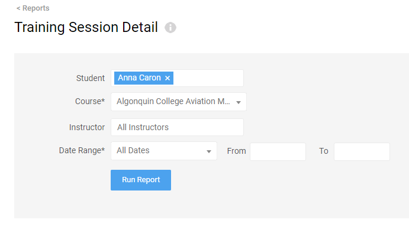
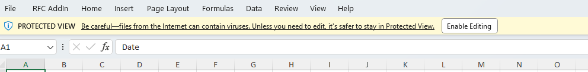
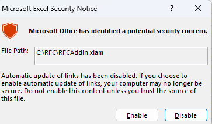
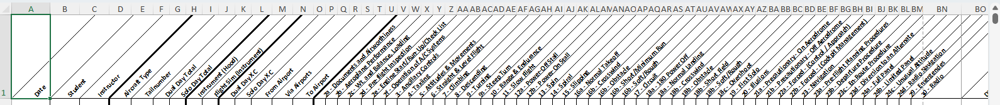

# RFC-PTRs
Rockcliffe Algonquin PTR conversion macros for Excel

- [RFC-PTRs](#rfc-ptrs)
  - [Installation](#installation)
  - [Unblocking the files](#unblocking-the-files)
  - [Setting up the addin in Excel](#setting-up-the-addin-in-excel)
  - [Exporting your Algonquin PTR from Flight Schedule Pro](#exporting-your-algonquin-ptr-from-flight-schedule-pro)

## Installation

Go to https://github.com/theonlyguills/RFC-PTRs

You will see this page

Click on the latest release on the right hand side. Download the zipped source code (first link)

Extract the contents to C:\RFC

It will look like this on disk:

## Unblocking the files

Depending on your version of Windows, you might have to unblock the files because they came from the internet and Windows does not like that. To check, right click the files **RFCAddIn.xlam** and **Rockliffe_Report_Macro.xlsm**, one by one, and go to Properties. If there is an 'Unblock' option, make sure it is checked.

This will look like this:

## Setting up the addin in Excel
Open a blank workbook in Excel. Right click on the ribbon, which is the grey area where the Bold, Italic, etc buttons are. Click Customize Ribbon...

In there click Add-ins in the left section then the Go... button next to Manage Excel Add-ins.

Click Browse and browse to the C:\RFC folder then select the addin file. You will now see the addin in the list and it should have a checkmark next to it.

You will now have a new tab in the ribbon called RFC with 2 buttons.

## Exporting your Algonquin PTR from Flight Schedule Pro

In FSP, Go to the Reports section and then click Training Session Detail under the Courses heading.

Select the student, the course and make sure it says All Instructors and the date range is set to All Dates.

Click Run Report and you will get an Excel file named **Training_Session_Detail_Report.xlsx**

Open that file in Excel and Enable Editing if it is locked.

If the PTR only has PPL exercises in it so far, click RFC PPL
If it has CPL exercises in it, click RFC CPL.

You might have to authorize the script to run

You should now have a printable PTR in PTR format

